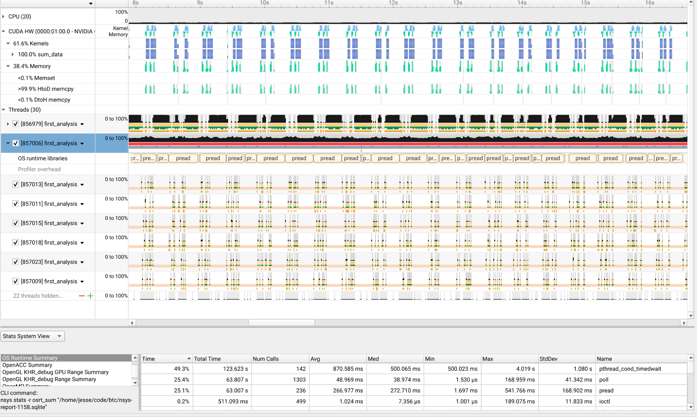

# ⚡ Binance Ultra-HFT Tick Processing Engine 
### 一个裸机级、硬件强耦合的性能概念验证模型

**Languages:** [English](README.md) | [简体中文](README.zh-CN.md) | [繁體中文](README.zh-TW.md) | [Español](README.es.md) | [Français](README.fr.md) | [Deutsch](README.de.md) | [日本語](README.ja.md) | [한국어](README.ko.md)

---

## 🇨🇳 中文版

> ⚠️ **严正声明 & 项目定性**
> 
> 1. **毫无通用性 (Zero Portability)：** 这**绝对不是**一个通用型基础库。整个代码库充满了硬编码（Hardcode），且与开发机的硬件拓扑（CPU 缓存行、PCIe 带宽、显存容量）进行了**极端强耦合**。**如果你在其他配置的电脑上运行，极大概率会直接 Segfault 报错或者性能暴跌。**
> 2. **拒绝维护：** 这是一个专为币安 (Binance) Tick 数据定制的、已完成的性能概念验证 (PoC) 模型。我没有精力、也不会对它进行后续维护与更新（除非我闲得发慌）。
> 3. **不提供任何盈利保障：** 本引擎不保证在真实实盘环境中的执行稳定性，更不保证任何交易策略的盈利。**请勿用于真实资金的交易。**
> 
> **为什么要开源？** 仅仅是为了展示 C++ 与 CUDA 在裸机级别（Bare-metal）的极限优化技术。欢迎各路开发者研究源码、交流底层网络/异构计算的技术实现，仅此而已。

### 模块与性能剖析

本项目由两个性能目标完全不同的独立模块构成。

#### 模块一：历史数据批处理 (`data_ingestion/` & `cuda_compute_engine/`)

这是项目的核心吞吐量引擎，专为在硬件物理极限下解析和计算海量历史数据集而设计。下述所有性能指标**仅适用于此模块**。

*(图中展示了 CPU `pread`、PCIe 异步 DMA 与 GPU Kernel 执行被完美重叠以掩盖 I/O 延迟)*

**目标硬件 (已硬编码优化):**
*   **CPU:** Intel Core i7-13650HX (14 核, 20 线程)
*   **GPU:** NVIDIA GeForce RTX 4060 Laptop GPU (8GB GDDR6)
*   **RAM:** 16GB DDR5 4800MHz (由于内存极小，逼迫系统采用了严格的核外/Out-of-Core 架构)
*   **Storage:** PCIe 3.0 NVMe SSD

**执行性能指标:**
*   **处理数据集:** 139 GB 的币安 BTC/USDT **现货**历史成交数据。解析器为此特定 CSV 格式硬编码，若用于处理 ETH 或其他交易对/数据类型，**极有可能导致解析失败**。
*   **执行耗时:** **约 60 秒** (使用物理秒表掐表计时)。
*   **持续吞吐量:** **约 2.31 GB/s**。
> *性能说明：这个60秒的稳定版本是为16GB内存限制而优化的配置。一个更激进的实验版本达到了约 **3.23 GB/s** 的峰值吞吐（139GB数据，同样通过秒表掐时为43秒），但其激进的内存预分配策略会超出16GB物理内存的承载极限，有导致系统卡死崩溃的风险。*

#### 模块二：实时网络网关 (`low_latency_gateway/`)
此模块的性能目标**不是吞吐量，而是极致的低延迟**。它使用裸机 Socket 编程连接币安 WebSocket 接口，并通过内核级网络调优（`TCP_NODELAY`）确保市场数据能以微秒级延迟被接收和处理。吞吐量指标不适用于此模块。

### ⚙️ 底层技术细节 (Extreme Engineering)
本项目抛弃了绝大多数现代高级抽象，直接与操作系统 POSIX 原语及硬件总线对话。

#### 1. 零分配的硬编码 I/O 流水线 (`data_ingestion/`)
*   **绕过磁盘瓶颈：** 庞大的 `.zip` 数据绝不落盘解压。通过 `convert.sh` 使用 `xargs` 并发拉起 `unzip -p`，将原始字节流通过 UNIX 管道直接打入 C++ 解析器的 `stdin`。
*   **手动浮点指针运算：** 彻底抛弃标准库的字符转浮点函数。`convert.cpp` 采用单次前向遍历，手动计算小数位偏移量（`fraction_count - 8`），将浮点价格强行转化为整型（Satoshi/0.01 USDT）以消除浮点运算开销。
*   **内存极度压榨：** 使用 `__attribute__((packed))` 禁用编译器字节对齐填充，将每笔订单数据强行压缩至 25-byte 的高密度结构体中，以最大化 CPU L1/L2 缓存命中率。

#### 2. 核外 (Out-of-Core) CUDA 计算引擎 (`cuda_compute_engine/`)
*   **L3 缓存与物理核绑定：** 使用 `pthread_setaffinity_np` 将负责 I/O 和计算的线程硬绑定到特定 CPU 物理核，强行剥夺操作系统的线程调度权，避免上下文切换导致的缓存失效。
*   **无锁双缓冲：** CPU 数据抓取与 GPU 任务提交之间没有任何互斥锁（Mutex），完全依靠 `std::atomic` 原子变量进行内存屏障同步。
*   **零拷贝 PCIe DMA：** 摒弃传统内存申请，使用 `cudaHostAlloc` 申请被锁定的物理内存（Pinned Memory）。CPU `pread` 将数据直接读入该区域，随后通过 `cudaMemcpyAsync` 越过 CPU 直接向 GPU 显存发起异步 DMA 搬运。

#### 3. 裸机极速网络网关 (`low_latency_gateway/`)
*   **内核级 Socket：** 剔除所有臃肿的 WebSocket 第三方库。直接调用 `<sys/socket.h>` 并用 OpenSSL 徒手封装 TLS/SNI 握手。
*   **微秒级网络微调：** 强行修改 TCP 协议栈行为。通过开启 `TCP_NODELAY` 禁用 Nagle 算法，禁止操作系统对微小数据包进行合并缓冲，确保市场盘口微波动的信号（Tick）以物理极限速度穿透网络层。
*   **直接帧解包：** WebSocket 协议帧头通过位运算（Bitwise）徒手解析，跳过所有 HTTP/WS 解析层，直接在内存缓冲区中定位 JSON 负载，关键路径（Hot Path）上杜绝任何 `std::string` 的堆分配（Heap Allocation）。